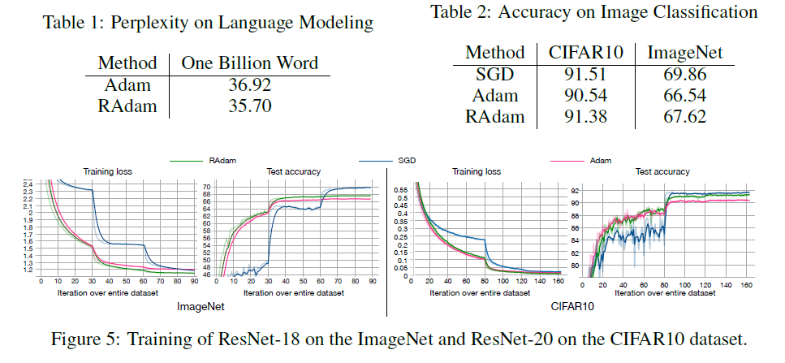
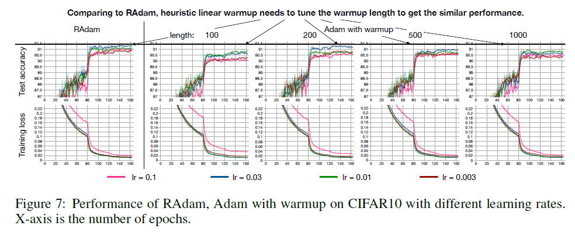
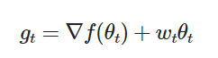
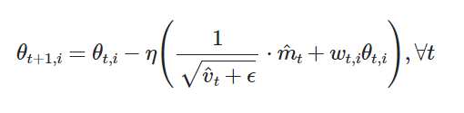

# 1. Radam

## Warmup
Optimizers using the adaptive learning rate have a fast convergence speed, but have a disadvantage that the gradient distribution is distorted during initial learning and falls into the local optimization.
So, to overcome this limitation, using method called warm up that sets the initial learning rate small.

## In Radam

The author argues that when calculating the adaptive learning rate at the initial stage of learning, the variance diverges because the sample is small, and this causes the value to be multiplied by the learning rate to increase without limit, leading to the local optima of learning.

The author says that the variance of the exponential moving average used for calculating the adaptive learning rate decreases monotonically as the degree of freedom increases, and the variance divergence problem can be solved by dynamically applying the adaptive learning rate based on the degree of freedom.

And, author shows that Radam is more robust than adam by experiment. 

 
 

# 2. Adamw

The author says that adam optimizer show great performance in many domain but in computer vision task, generalization is inferior to SGD including momentum.

And the Author propose Adamw optimizer that modifies the typical implementation of weight decay in Adam, by decoupling weight decay from the gradient update.

In Adam, L2 regularization Implemented as below.

 

while AdamW modifies the weight decay term to appear in the gradient update

 
