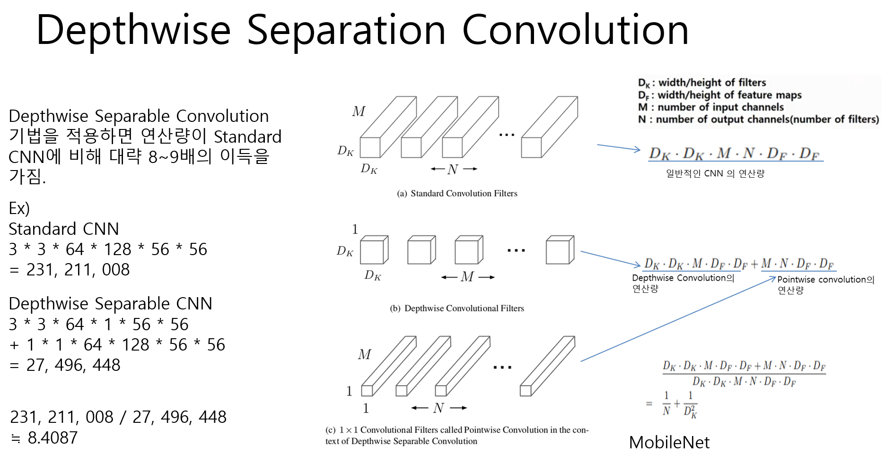
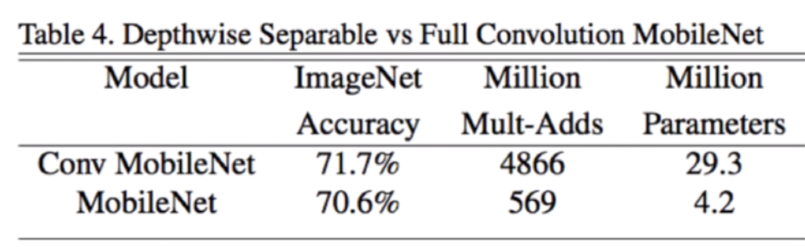

# 1. Is it efcient to use matrix multiplication to implement convolution operations? Why?

Yes, There are 2 ways.

## 1. VGG

This method proposed in VGG.

the main idea is that replace one 5 * 5 convolution to two 3 * 3 convolution

The authors argued that this method can reduce the number of parameters and build a deep network.

## 2. Depthwise Seperable convolution

This method proposed in mobilenet. 

The main idea is that seperate convolution as depthwise convolution and pointwise convolution

 

The result is as follow.

 
